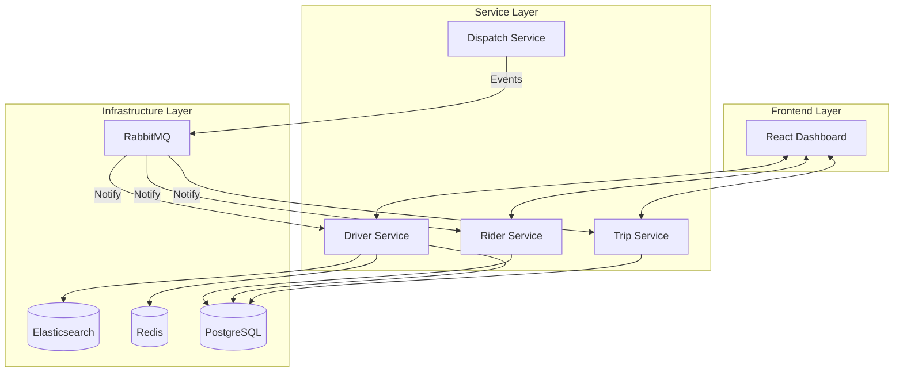
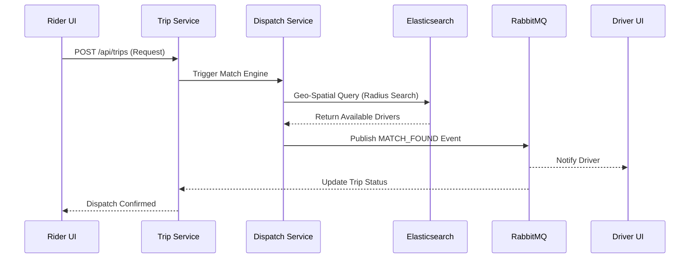
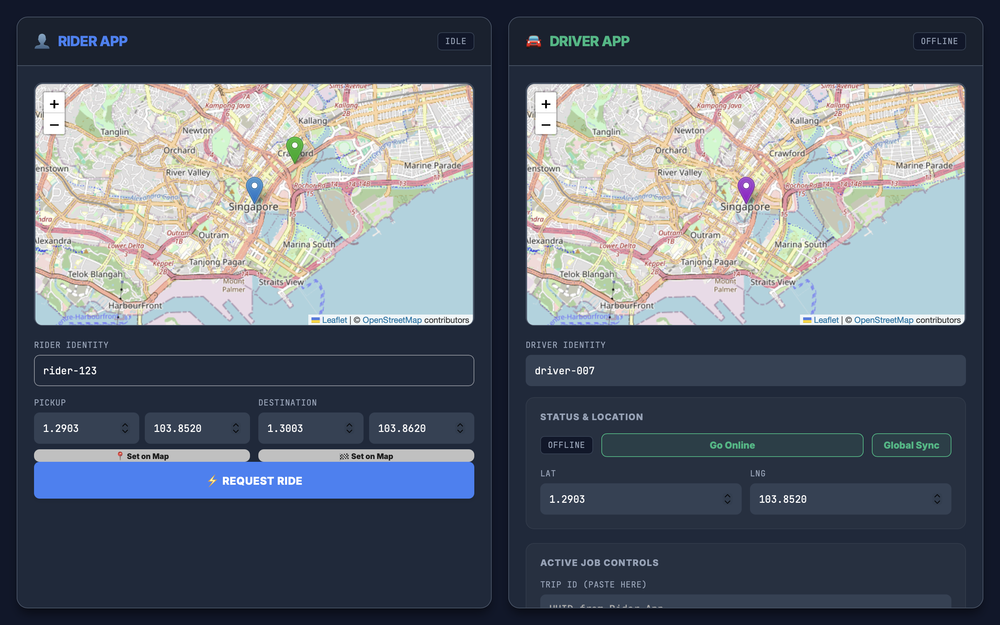

# 🚀 NexRide: Distributed Ride-Hailing Platform


NexRide is a high-performance, scalable ride-hailing system built on a modern microservices architecture. It simulates the end-to-end lifecycle of a ride-matching platform, from real-time driver location tracking to automated dispatching and trip management.

This project demonstrates expertise in **distributed systems**, **event-driven architecture**, and **full-stack development**, showcasing how complex industrial applications handle high-frequency data and real-time state synchronization.

---

## 🌟 Key Features

*   **Real-time Geospatial Matching**: Leverages **Elasticsearch** for high-speed proximity searches, ensuring riders are matched with the closest available drivers.
*   **Dynamic Location Tracking**: Handles high-frequency driver updates using **Redis** for sub-millisecond latency.
*   **Event-Driven Communication**: Decoupled microservices communicate through **RabbitMQ**, ensuring system resilience and eventual consistency.
*   **Comprehensive Trip Lifecycle**: Robust state management for trips (REQUESTED → MATCHED → IN_PROGRESS → COMPLETED).
*   **Interactive Full-Stack Dashboard**: React-based control center with real-time map integration via **Leaflet.js**.

---

## 🏗️ System Architecture

The system is composed of specialized microservices, each owning a specific domain and scaling independently.



---

## 🛠️ Technology Stack

| Category | Technologies |
| :--- | :--- |
| **Backend** | Java 17+, Spring Boot 3, Spring Data (JPA, Redis, Elasticsearch) |
| **Frontend** | React, Vite, Leaflet.js, Axios, CSS Modules |
| **Database** | PostgreSQL 15 (Relational), Redis 7 (Cache/Location), Elasticsearch 7 (Geo-Search) |
| **Messaging** | RabbitMQ 3 (Event Bus) |
| **DevOps** | Docker, Docker Compose, Maven |

---

## 📂 Project Structure

```text
.
├── backend/
│   ├── common/             # Shared DTOs and utilities
│   ├── driver-service/     # Driver management & location ingestion
│   ├── rider-service/      # Rider profiles & authentication
│   ├── trip-service/       # Trip state & history management
│   └── dispatch-service/   # Matching engine & orchestration
├── frontend/               # React application (Vite-powered)
├── infra/                  # Docker Compose infrastructure
└── README.md
```

---

## 🚀 Installation Guide

### Prerequisites
*   **Docker & Docker Compose**
*   **Java 17+** & **Maven**
*   **Node.js 18+**

### Step 1: Spin up Infrastructure
```bash
cd infra
docker-compose up -d
```

### Step 2: Build & Start Backend Services
In the `backend` directory, run each service (ideally in separate terminals or as background processes):
```bash
mvn spring-boot:run -pl driver-service
mvn spring-boot:run -pl trip-service
mvn spring-boot:run -pl dispatch-service
mvn spring-boot:run -pl rider-service
```

### Step 3: Launch Frontend
```bash
cd frontend
npm install
npm run dev
```
The application will be available at `http://localhost:3000`.

---

## 📖 API Documentation Example

### Trip Request
`POST /api/trips`
Initiates a new ride request and triggers the dispatch matching engine.

**Request Payload:**
```json
{
  "riderId": "rider-123",
  "pickupLat": 1.2878,
  "pickupLng": 103.8666,
  "dropoffLat": 1.3000,
  "dropoffLng": 103.9000
}
```

**Workflow:**
1.  `Trip Service` persists the request.
2.  `Dispatch Service` queries `Elasticsearch` for nearby online drivers.
3.  `RabbitMQ` broadcasts the match to relevant services and the frontend.

---

## 🔄 System Workflow



---

## 📸 Screenshots


*Figure: NexRide Rider and Driver Dashboards featuring real-time map integration and trip controls.*

---

## 🛡️ License
Distribute under the MIT License. See `LICENSE` for more information.
